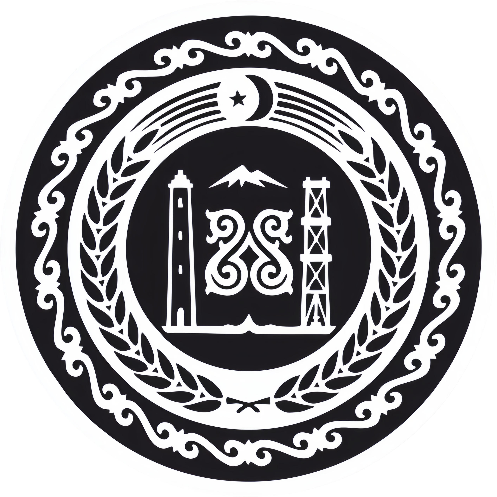

# Chechen-Russian Telegram Bot Translator

<div align="center">
  
</div>

## Описание

Этот Telegram бот предназначен для перевода слов с русского на чеченский и с чеченского на русский.

## Возможности

- Перевод с русского на чеченский
- Перевод с чеченского на русский
- Использование как в личных сообщениях, так и в группах

## Использование

### В личных сообщениях

Просто отправьте слово на русском или чеченском языке, и бот вернет его перевод.

### В группе

Добавьте бота в группу и отправьте сообщение, начинающееся с `/`, содержащее слово для перевода. Пример:

```
/клубника
```

## Установка

1. Клонируйте репозиторий:

    ```bash
    git clone https://github.com/Zelimkhan-Magomadov/ChechenSpeakBot.git
    ```

2. Установите зависимости:

    ```bash
    pip install -r requirements.txt
    ```

3. Настройте переменные окружения в `.env` файле:

    ```env
    BOT_TOKEN=your_telegram_bot_token
    ```

4. Запустите бота:

    ```bash
    python main.py
    ```

## Источники
Данные для перевода берутся из базы данных сайта [ps95.ru](https://ps95.ru/dikdosham/ru/)

Данные основаны на базе следующих источников:

- Мациев А.Г. Чеченско-русский словарь.
- Карасаев А.Т., Мациев А.Г. Русско-чеченский словарь.
- Умархаджиев С.М., Ахматукаев А.А. Чеченско-русский, русско-чеченский словарь математических терминов.
- Абдурашидов Э.Д. Чеченско-русский, русско-чеченский словарь юридических терминов.
- Берсанов Р.У. Чеченско-русский, русско-чеченский словарь анатомии человека.
- Умархаджиев С.М., Асхабов Х.И., Бадаева А.С., Вагапов А.Д., Израилова Э.С., Султанов З.А., Астемиров А.В. Русско-чеченский, чеченско-русский словарь компьютерной лексики.
- Байсултанов Д.Б. Чеченско-русский словарь ("Дескриптивный словарь лексем чеченского языка, не вошедших в "Чеченско-русский словарь" А. Мациева (1961 г.)").
- Исмаилов А. Чеченско-русский, русско-чеченский словарь из книги "Дош".
- Аслаханов С-А.М. Русско-чеченский словарь спортивных терминов и словосочетаний.
- Даукаев А.А. Русско-чеченский словарь геолого-минералогических терминов.

## Лицензия

Этот проект лицензирован под [MIT License](./LICENSE).
